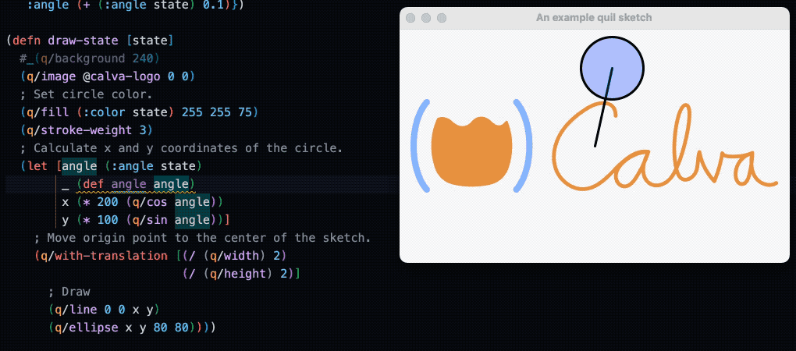
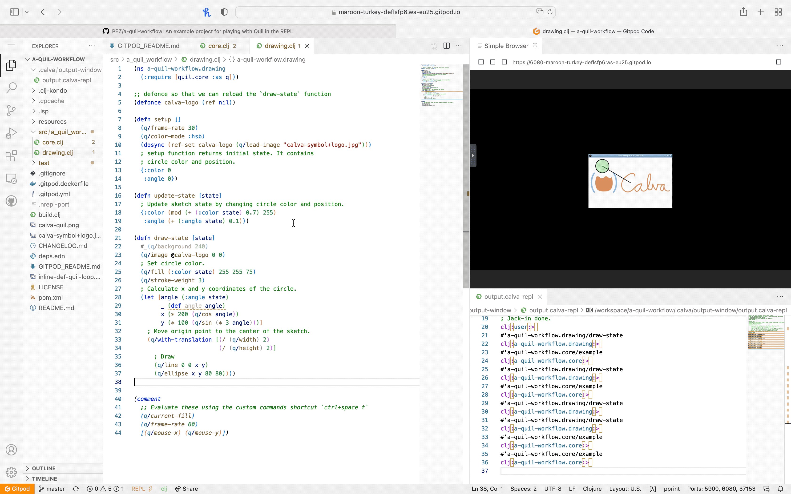

# a-quil-workflow

An example project template for playing with Quil in the REPL

See https://blog.agical.se/posts/calva-quil-workflow/ for more info about it.

## Prepared for Gitpod

If you want to try this project out and don't have Clojure prepared and/nor a Clojure IDE/editor, you can open this repository (wether it is your copy of the template or not) in Gitpod by editing the URL and prepend it with `https://gitpod.io/#`. It might take quite a while the first time you do this.

This is what it looks like running in Gitpod:

## License

MIT